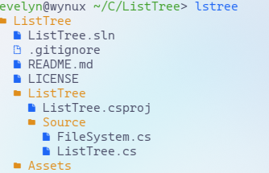

# ListTree

ListTree, or lstree, is a small cli app that wants to replace the original `ls -R` command. Making it more readable and prettier.

## Showcase


## Usage
Simply run `lstree`.

You can use `--depth <num>` or `-d <num>` to show a specific depth.

Anything else will be treated like a path. 

For example running:
`lstree --depth 5 ~/.config ~/Code` will show the contents of ~/.config and ~/Code with a maximum depth of 5.

## Installation

### Pre-requisites
Since lstree is made using C#, you will need to install the dotnet runtime and sdk.

#### For Linux
```bash
# # Fedora
sudo dnf ins dotnet-sdk-8.0 dotnet-runtime-8.0

# # Arch linux
sudo pacman -S dotnet-sdk dotnet-runtime

# # Ubuntu
sudo apt-get install dotnet-sdk-8.0 dotnet-runtime-8.0
```

#### For windows

Using a package manager:
```bash
# Scoop
scoop bucket add main
scoop install main/dotnet-sdk

# Winget
winget install dotnet-sdk-8
winget install dotnet-runtime-8
```

Manually:

https://learn.microsoft.com/en-us/dotnet/core/install/windows?tabs=net80

### Compiling
Now that you have dotnet installed, it's time to compile and install it!

If you're on windows, fire up powershell in administrator mode.

```bash
git clone https://github.com/its-Lyn/ListTree
cd ListTree

dotnet publish -c Release -p:PublishSingleFile=true

cd ./ListTree/bin/Release/net8.0/<your_os>-<your_arch>/publish

# For linux
sudo mv ./ListTree /usr/local/bin/lstree

# For Windows
# # This is definitely not advised. But it works.
mv ./ListTree C:\Windows\system32\lstree
```

